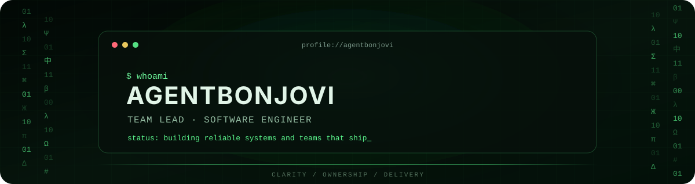
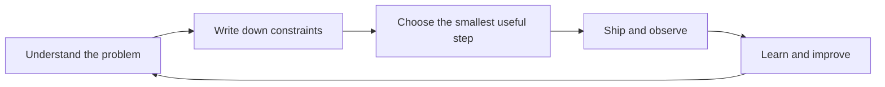

<p align="center">
  
</p>

<p align="center">
  <code>TEAM LEAD</code>&nbsp;&nbsp;·&nbsp;&nbsp;<code>SOFTWARE ENGINEER</code>&nbsp;&nbsp;·&nbsp;&nbsp;<code>SYSTEMS THINKER</code>
</p>

<p align="center">
  I turn ambiguous product goals into clear technical decisions,<br />
  reliable systems, and teams that ship.
</p>

---

### `> current_focus`

- Leading engineering work from discovery to production
- Designing maintainable backend and AI-enabled systems
- Making delivery predictable through small batches and clear ownership
- Improving observability, developer experience, and operational quality

### `> toolbox`

`Rust` · `Python` · `Docker` · `Git` · `PostgreSQL` · `Linux` · `JavaScript` · `C++` · `Django` · `Agile` · `Scrum`

### `> how_i_lead`

```text
01  Give people context, ownership, and room to make decisions.
02  Prefer small pull requests and fast feedback over heroic releases.
03  Write down decisions so the team does not depend on memory.
04  Measure outcomes, reliability, and lead time — not visible busyness.
05  Fix the system that produced a problem, not only the symptom.
```

### `> engineering_values`

| Principle | What it means in practice |
| :--- | :--- |
| **Clarity** | Explicit goals, constraints, owners, and definitions of done |
| **Reliability** | Useful tests, observability, safe delivery, and boring operations |
| **Leverage** | Automation, reusable patterns, and tools that remove repeated work |
| **Growth** | Direct feedback, shared context, and increasingly independent engineers |

### `> collaboration_protocol`



<details>
  <summary><strong>What I care about in a code review</strong></summary>
  <br />

- Is the reason for the change clear?
- Does the design remain understandable six months from now?
- Are failure modes visible and recoverable?
- Is the change small enough to review with confidence?
- Did we improve the system, or merely move complexity elsewhere?

</details>

---

<p align="center">
  <a href="https://github.com/agentbonjovi?tab=repositories">Projects</a>
  &nbsp;·&nbsp;
  <a href="https://github.com/agentbonjovi?tab=stars">Curated tools</a>
  &nbsp;·&nbsp;
  <a href="https://github.com/agentbonjovi">GitHub profile</a>
</p>

<p align="center">
  <sub><code>connection established // build thoughtfully // ship reliably</code></sub>
</p>
